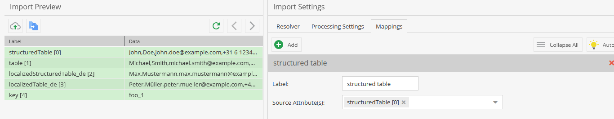
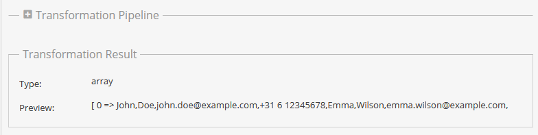
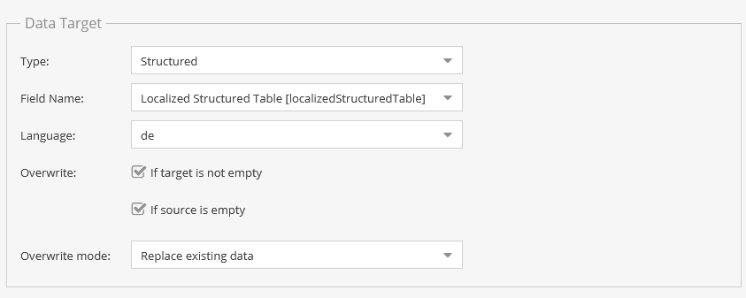

# Pimcore Structured Data Import Bundle

This bundle extends the Pimcore Data Importer with support for importing data into Pimcore `Table` and `Structured Table` data types.

## Problem

The Pimcore Data Importer provides a convenient UI for mapping external data to Pimcores Data Object fields. However, `Table` and `Structured Table` fields are not available as regular mapping targets in the standard importer.

This means that importing data into these field types cannot simply be configured through the Data Importer UI.

A possible workaround would be to implement custom event listeners to process the data, for example, during the pre-add event of the data objects. However, this approach is rather hacky. Without modifying the Data Importer itself, you would first have to create a “fake” text field in the class editor and use it as the import target. The imported data could then be stored there as a comma-separated list of values. An event listener would have to listen for the appropriate Data Object event, retrieve the data from the fake field, parse and transform it, and finally write the resulting data into the corresponding `Table` or `Structured Table` field.

This works, but it introduces unnecessary intermediate fields and custom event-driven logic just to support a data type that should ideally be handled directly in the Data Importer mapping..

And that’s exactly what this bundle is for.

## Features

- New data target type: **`Structured`**
- Support for `Table` and `Structured Table` fields, regardless of whether they are defined in a class, localized, or used within an Object Brick

The existing Data Importer workflow remains unchanged.

## Usage

The import is configured using the existing Data Importer mapping workflow.

### 1. Prepare the source data

All values to be imported into a table for a single object would need to be provided in one or multiple cells (which can then be combined in the mapper) and converted into an array. For example, a CSV file could look like this:

```csv
structuredTable,table,localizedStructuredTable_de,localizedTable_de,key
"John,Doe,john.doe@example.com,+31 6 12345678,Emma,Wilson,emma.wilson@example.com,+31 6 23456789","Michael,Smith,michael.smith@example.com,+31 6 34567890,Sophie,Brown,sophie.brown@example.com,+31 6 45678901","Max,Mustermann,max.mustermann@example.com,+49 151 12345678,Anna,Schmidt,anna.schmidt@example.com,+49 152 23456789","Peter,Müller,peter.mueller@example.com,+49 160 34567890,Lisa,Schneider,lisa.schneider@example.com,+49 171 45678901",foo_1
"Daniel,Miller,daniel.miller@example.com,+31 6 56789012,Olivia,Davis,olivia.davis@example.com,+31 6 67890123","James,Anderson,james.anderson@example.com,+31 6 78901234,Charlotte,Taylor,charlotte.taylor@example.com,+31 6 89012345","Thomas,Weber,thomas.weber@example.com,+49 172 56789012,Julia,Wagner,julia.wagner@example.com,+49 173 67890123","Michael,Fischer,michael.fischer@example.com,+49 174 78901234,Sarah,Becker,sarah.becker@example.com,+49 175 89012345",foo_2
"Robert,Thomas,robert.thomas@example.com,+31 6 90123456,Amelia,Jackson,amelia.jackson@example.com,+31 6 01234567","William,White,william.white@example.com,+31 6 11223344,Grace,Harris,grace.harris@example.com,+31 6 22334455","Andreas,Hoffmann,andreas.hoffmann@example.com,+49 176 90123456,Laura,Schäfer,laura.schaefer@example.com,+49 177 01234567","Stefan,Koch,stefan.koch@example.com,+49 178 11223344,Nina,Bauer,nina.bauer@example.com,+49 179 22334455",foo_3
```

### 2. Mapping

The mapping of the data to be imported is configured as usual in the **Pimcore Data Importer Mapping UI**.

For `Table` and `Structured Table` fields, the newly added **`Structured`** target type can be selected.

If the input has been transformed into an array, the **`Structured`** target type provides all available `Table` and `Structured Table` fields of the selected Pimcore class as mapping targets.

For example:

1. Select the source column in the mapping. (You can also concatenate values from multiple columns)

   

   <br>

2. Transform the input into an array using the **`As Array`** transformation.

   

   <br>

3. Select the newly available **`Structured`** target type.

4. Select the desired `Table` or `Structured Table` field.

5. For localized fields, select the corresponding language.

6. Choose whether existing data should be **overwritten** or whether the imported data should be **merged** with the existing data.

   

The imports are then started as usual.

## Installation

### 1. Add the repository

The bundle is installed through a VCS repository.

Add the following repository to the `composer.json` of your Pimcore project:

```json
"repositories": [
    {
        "type": "vcs",
        "url": "git@github.com:Girgl1995/pimcore-structured-data-import-bundle.git"
    }
]
```

### 2. Install the bundle

Install the bundle using Composer:

```bash
composer require factotum/structured-data-import-bundle:dev-master
```

### 3. Register the bundle

After installing the bundle, register it in `config/bundles.php`:

```php
// ...
use Factotum\StructuredDataImportBundle\PimcoreStructuredDataImportBundle;

return [
    // ...
    PimcoreStructuredDataImportBundle::class => ['all' => true]
];
```

### 4. Install the assets

After registering the bundle, install the bundle and its assets:

```bash
bin/console assets:install
```

### 5. Clear the Cache

After completing the changes, clear the cache:

```bash
bin/console cache:clear
bin/console pimcore:cache:clear
```
